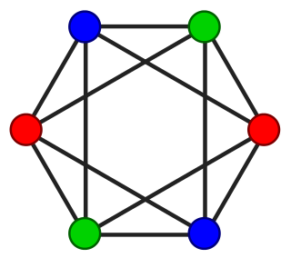
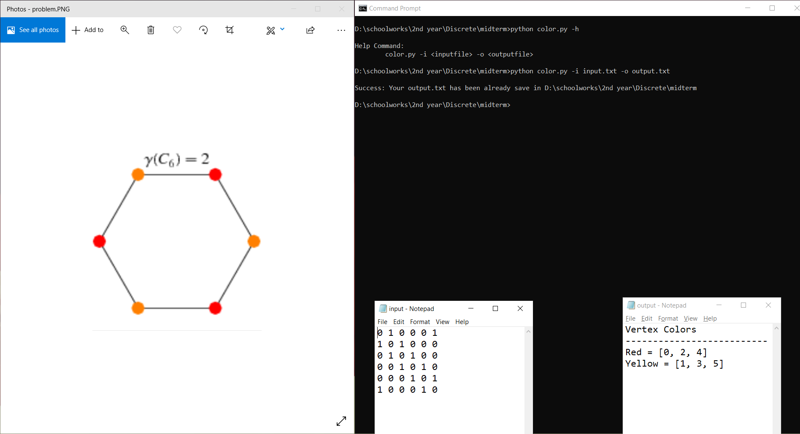

# Graph Coloring

 Graph coloring problem is just one in a large class of intractable problems called NP-complete problems, all of which take at least exponential time to solve. In practice, such problems are solved using algorithms which yield an approximate solution (for instance, one that is suboptimal) in a reasonable amount of time. Such an algorithm is called a heuristic. For the graph coloring problem, the following heuristic produces a legal, though not necessarily optimal, coloring. This script was written in Python language and one of the machine problems in my Discrete Subject 2.

 ## Flow of the program

 Given an input.txt file that contains the adjacency matrix representation of a graph, it output the colors of each vertex to output.txt where no two adjacent vertices should have the same color.

 
